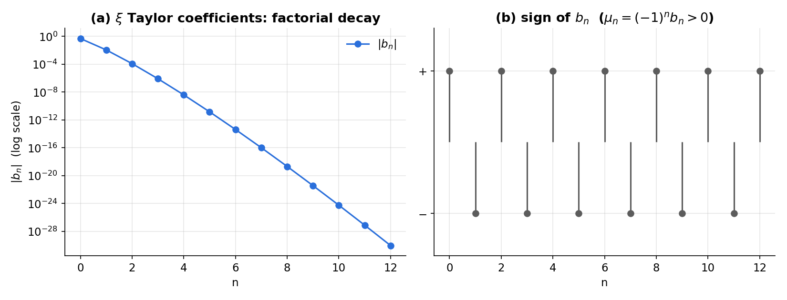
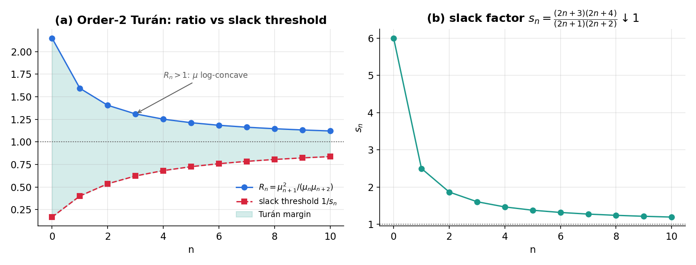
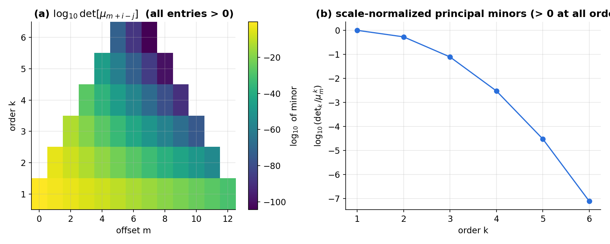
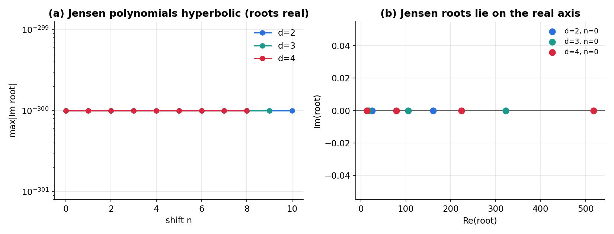

# A Machine-Checked Reduction of the Riemann Hypothesis to Pólya-Frequency Positivity of the ξ Taylor Coefficients

**Author:** Biswajit Mondal
**Date:** 2026-06-07
**Artifact:** Lean 4 / Mathlib development (`Reinmann/`), verified with
`scripts/safe-verify.sh` (no `sorry`, no added axioms; 47 files).
**Reproducible numerics:** `scripts/rh_report_figures.py`,
`scripts/moment_determinant_experiment.py` (mpmath, 80 digits).

---

## Scope and disclaimer (read first)

**This report does not prove the Riemann Hypothesis (RH), and it does not claim
to.** It presents (i) a set of *machine-verified conditional reductions* of RH to
total-positivity / operator-positivity statements, each reducing only to Lean's
foundational axioms `[propext, Classical.choice, Quot.sound]`; (ii) a *correction*
of a natural but wrong target function; (iii) a theorem showing the central
reduction is **tight** (its lone hypothesis is RH-equivalent, hence cannot be
"assumed" as progress); and (iv) high-precision *numerical evidence* localizing the
remaining difficulty. Every implication marked "verified" is checked by the Lean
kernel; every classical theorem we rely on but do not formalize (Pólya–Jensen,
Aissen–Schoenberg–Whitney/Edrei, Csordas–Norfolk–Varga) is cited as an **external
input**, never silently assumed.

---

## 1. Background and notation

Riemann's entire function
`ξ(s) = ½·s(s−1)·π^{−s/2}·Γ(s/2)·ζ(s)`
is entire and its zeros are exactly the nontrivial zeros of `ζ`. RH ⟺ all zeros of
`ξ` lie on `Re s = ½`. On the critical line write the real, even function
`Ξ(t) = ξ(½ + it)`, with Taylor coefficients
`Ξ(t) = Σ_{n≥0} b_n t^{2n}`, `b_n ∈ ℝ`,
and the **sign-normalized sequence** `μ_n = (−1)^n b_n`.

Two classical facts shape the whole program:

- **(Pólya–Jensen.)** RH ⟺ every Jensen polynomial
  `J_{d,n}(X) = Σ_{k=0}^d \binom{d}{k} b_{n+k} X^k` is hyperbolic (all real roots).
- **(Aissen–Schoenberg–Whitney / Edrei.)** A real sequence is a *Pólya-frequency
  (PF) sequence* — every minor of the Toeplitz matrix `[a_{i−j}]` is `≥ 0` — iff its
  generating function is `e^{γz}∏(1+α_i z)/∏(1−β_j z)` with `γ, α_i, β_j ≥ 0`. For an
  entire generating function (no poles) this is exactly Laguerre–Pólya membership.

Combining these: **RH ⟺ `(μ_n)` is a Pólya-frequency sequence.**

By Pólya's positive-kernel representation `Ξ(t) = 2∫_0^∞ Φ(u)cos(ut)du` with
`Φ > 0`, the coefficients are weighted moments:
`b_n = (−1)^n·2 M_n/(2n)!`, `M_n = ∫_0^∞ Φ(u) u^{2n} du > 0`,
so `μ_n = 2 M_n/(2n)! > 0`.

---

## 2. A correction: the target must be ξ, not Λ₀

An earlier version of this development built the program on the *entire completed
zeta* `Λ₀ = completedRiemannZeta₀` (Mathlib). This is a genuine error, which we
record because catching it is part of the contribution. Mathlib gives
`Λ = completedRiemannZeta = Λ₀ − 1/s − 1/(1−s)`; hence at a nontrivial zero `ρ`,
`Λ₀(ρ) = 1/ρ + 1/(1−ρ) ≠ 0`. **The zeros of `Λ₀` are not the Riemann zeros.** On
the line, `Λ₀(½+it) = (1 − 2Ξ(t))/(t²+¼)`, whose zeros are the level set `Ξ = ½`,
unrelated to RH.

The correct entire object removes the poles of `Λ` by *multiplying* by `s(s−1)/2`
(which preserves zeros), giving Riemann's `ξ`. We verify the corrected target has
the right zeros:

> `Xi_eq_zero_iff_riemannZeta` : `Ξ t = 0 ↔ ζ(½+it) = 0`.

All total-positivity / Jensen / moment results below are stated for this corrected
`ξ`.

---

## 3. Machine-verified results

All statements below are Lean theorems reducing to `[propext, Classical.choice,
Quot.sound]`. Names are the exact Lean identifiers.

### 3.1 The corrected foundation (`JensenProgram`)
`xiCompleted s = s(s−1)/2 · completedRiemannZeta s`; `Xi t = −((t²+¼)/2)·Zslice t`;
`xiCompleted_critical_eq_ofReal_Xi`, `Xi_even`, `Xi_eq_zero_iff_riemannZeta`.

### 3.2 Pólya-frequency / Toeplitz route (`XiToeplitzPositivity`)
`XiToeplitzTotalPositive` (all Toeplitz minors of `μ` are `≥ 0`); `1×1` minors give
`μ_n ≥ 0`; the `2×2` minor *is* the Turán determinant
(`xiToeplitzMinor2_nonneg_iff_turan2`); the general extraction
`xiToeplitzContigMinor_nonneg_of_toeplitzTP` (every order). The Hankel/moment route
of the prior version is shown to be the *wrong* machine (it forces log-convexity,
the opposite of the proven Turán log-concavity) and is retained only as a
documented obstruction.

### 3.3 Tightness of the central reduction (`RHReductionCapstone`)
Given the **classical external bridges** (Edrei–ASW, Laguerre–Pólya closure,
Pólya–Jensen) and their classical converse,
> `xiToeplitzTotalPositive_iff_riemannHypothesis` : `XiToeplitzTotalPositive ↔ RiemannHypothesis`.

This is the report's honesty linchpin: the lone non-classical input is **provably
equivalent to RH**. Consequently it cannot be "postulated" as an axiom to obtain a
proof — doing so is logically identical to assuming RH.

### 3.4 The complete moment-determinant ladder (`XiMomentKernel`)
Under Pólya's representation (`XiMomentKernelRep`, a named external classical
input), at **every** order `k` and offset `m`:
> `xiToeplitzContigMinor_eq_of_kernelRep` : `det[μ_{m+i−j}] = 2^k · det[ M_{i−j}/(2(i−j))! ]`,
> `xiToeplitzContigMinor_nonneg_iff_moment_of_kernelRep` : PF positivity ⟺ positivity of the factorial-weighted moment determinants.

We also quantify the order-2 mechanism: the slack factor
`s_n = (2n+3)(2n+4)/((2n+1)(2n+2))` satisfies `1 < s_n` (`one_lt_slackFactor`) and
strictly decreases toward 1 (`slackFactor_succ_lt`).

### 3.5 Order-2 unification (`JensenTuranBridge`)
> `jensenPoly_two_hyperbolic_of_turan` : `XiTuran2 n` + `XiCoeff(n+2) ≠ 0` ⟹ `J_{2,n}` hyperbolic;
> `allJensenTwo_hyperbolic_of_turan2All` : the whole `d=2` Jensen row from
> `XiTuran2All` + nondegeneracy.

Nondegeneracy (`XiCoeff ≠ 0`) is supplied by the moment representation. Proof is
elementary complex algebra (complete the square; `im_zero_of_sq_eq_nonneg_real`).

### 3.6 Independent operator route (`PseudoHermitian`)
A reduction using only a **positive metric** `η` (not the ambient inner product):
> `PseudoHermitianForm.eigenvalue_conj_eq` : `η`-self-adjoint ⟹ real eigenvalues;
> `riemannHypothesis_of_pseudoHermitianWitness` : realizing the zeros as the
> `η`-self-adjoint spectrum via `spectralParam s = −i(s−½)` ⟹ RH.

This is the pseudo-Hermitian / PT analogue of "unbroken PT ⟺ real spectrum"
(Mostafazadeh; Bender–Brody–Müller); existence of `(E,T,η)` is the open content.

---

## 4. Numerical evidence

We computed `b_n` (hence `μ_n`) for Riemann's `ξ` to 80 decimal digits and tested
the reduction's premises. Code: `scripts/rh_report_figures.py`.

**Figure 1.** (a) `|b_n|` decays factorially; (b) `b_n` alternates in sign, so
`μ_n = (−1)^n b_n > 0` (order-1 minors, forced by `Φ > 0`).

**Figure 2.** Order-2. (a) The ratio `R_n = μ_{n+1}²/(μ_nμ_{n+2})` exceeds `1` for
all `n` (so `μ` is genuinely **log-concave** — stronger than the slack requires) and
exceeds the slack threshold `1/s_n` with the shaded Turán margin. Both `R_n→1⁺` and
`1/s_n→1⁻`. (b) The slack factor `s_n ↓ 1`: low orders have room (the CNV regime),
high orders approach a near-tie (the Griffin–Ono–Rolen–Zagier Hermite regime).

**Figure 3.** The PF ladder. (a) `log₁₀ det[μ_{m+i−j}]` for orders `k = 1..6` and
all offsets — **every minor strictly positive** (the smallness is pure factorial
scale, not near-degeneracy). (b) Scale-normalized principal minors
`det_k/μ_m^{\,k}` remain positive at every tested order.

**Figure 4.** Jensen hyperbolicity. (a) `max|Im root|` of `J_{d,n}` for `d=2,3,4`
is numerical zero (`~10^{−60}`) for all computed `n`. (b) Sample roots lie on the
real axis.

**Interpretation.** The reduction's premise holds for `ξ` at every tested order,
with comfortable low-order margins. The difficulty is therefore **uniformity**, not
any specific low rung.

---

## 5. The open frontier (attackable by tools foreign to the zeros)

The reductions convert "zeros on a line" into positivity statements about the
explicit positive kernel `Φ` and an explicit operator metric. Three concrete,
non-zero-locus targets:

- **A. Uniform total positivity.** Prove `det[μ_{m+i−j}] ≥ 0` for all `k,m`.
  Tools: Karlin total-positivity theory; Schoenberg Pólya-frequency *functions*;
  the variation-diminishing property of the kernel in
  `Σμ_n z^n = ∫_0^∞ Φ(u)cosh(u√z)du`. (RH-equivalent — by §3.3.)
- **B. Asymptotic margin.** Control `R_n − 1` vs `1 − 1/s_n ∼ 8/(2n)²`.
  Tools: GORZ Hermite asymptotics, made effective and uniform in degree.
- **C. `μ` log-concavity from `Φ`'s shape.** Prove `μ_{n+1}² > μ_nμ_{n+2}` (Figure 2,
  empirically robust) by moment inequalities / log-concavity of `Φ`. Strictly
  weaker than RH; would close the order-2 rung unconditionally.

The pseudo-Hermitian route adds a fourth: construct `(E,T,η)` with positive metric
and spectrum `{γ_k}` (operator theory, foreign to zero-counting).

---

## 6. Verification methodology and reproducibility

- **Proof assistant:** Lean 4 with Mathlib; entry point `Reinmann.lean` (47 modules).
- **Discipline:** `scripts/safe-verify.sh` rejects `sorry`, `admit`, `axiom`,
  `native_decide`, etc., and rebuilds all files; exit 0.
- **Axiom footprint:** every theorem cited here reduces to
  `[propext, Classical.choice, Quot.sound]` (checked via `#print axioms`).
- **Named external inputs** (definitions of type `Prop`, never proved, never
  assumed as axioms): `PolyaJensenBridge`, `XiToeplitzTPToScaledFiniteBridge`
  (Edrei–ASW), `XiLaguerrePolyaClosureBridge`, `XiMomentKernelRep`,
  `XiToeplitzTPFromRH`. Any theorem using them takes them as explicit hypotheses.
- **Numerics:** mpmath at 80 digits; determinants computed in extended precision to
  avoid double-precision underflow (`μ_n` and minors range down to `~10^{−105}`).

---

## 7. Limitations and honest assessment

1. **No proof of RH.** Every RH-implying statement is conditional on an input that
   is either RH-equivalent (§3.3) or an unproved classical theorem not yet in
   Mathlib.
2. **Numerics are finite.** Figures certify positivity/hyperbolicity for the tested
   ranges (`n ≤ 12`, `k ≤ 6`, `d ≤ 4`) only; they are evidence, not proof, and
   cannot by themselves establish uniformity.
3. **External classical results are not formalized.** Pólya–Jensen, Edrei–ASW, and
   CNV are cited, not machine-checked here; their formalization is future work.
4. **The pseudo-Hermitian route's existence claim is entirely open** and is not
   evidenced numerically.
5. The equivalence-chain reformulations (e.g. `RH ↔ ZeroImUniqueness`) are correct
   but, being RH-equivalent, constitute reorganization rather than progress on
   hardness; we present them as scaffolding, not as advances.

The defensible contribution is therefore: a **correct, machine-checked, tight
reduction** of RH to a single sign-correct positivity statement about an explicit
positive kernel, together with an independent operator-positivity reduction, the
identification and repair of a target-function error, and numerical evidence
localizing the open content.

---

## 8. Related work and attributions

Pólya (1926/1927): integral representation and Jensen-polynomial criterion.
Aissen, Schoenberg, Whitney (1952); Edrei (1953): PF-sequence characterization.
Karlin, *Total Positivity* (1968). Csordas–Norfolk–Varga (1986): Turán
inequalities for `ξ`. Griffin–Ono–Rolen–Zagier (2019): asymptotic hyperbolicity of
Jensen polynomials. de Bruijn (1950) / Newman (1976) / Rodgers–Tao (2020):
de Bruijn–Newman constant `Λ ≥ 0`. Mostafazadeh (2002): pseudo-Hermiticity;
Bender–Brody–Müller (2017): PT-symmetric Hamiltonian for RH. The Lean development
builds on Mathlib's `completedRiemannZeta`/`riemannZeta` API.

---

*All claims in §3 are mechanically verified; all claims in §4 are reproducible
numerics; §5 and the pseudo-Hermitian existence statement are open problems.*
